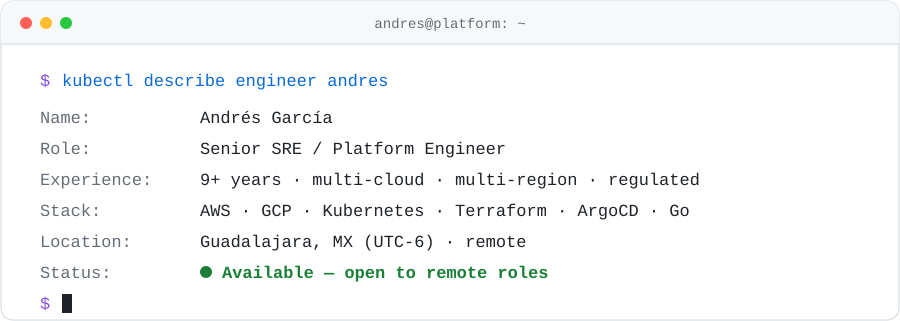

<picture>
  <source media="(prefers-color-scheme: dark)" srcset="assets/header-dark.svg">
  
</picture>

### 🟢 All systems operational

| Component | SLI | Status |
|---|---|---|
| Live streaming at scale | **20–30M concurrent viewers** during live sports, multi-region across three continents | 🟢&nbsp;Operational |
| Regulated banking core | **99.99% availability** through a fintech → regulated bank transition | 🟢&nbsp;Operational |
| Company-wide AI platform | AI gateway + MCP rollout: governed LLM access, cost tracking and rate limits **for every team** | 🟢&nbsp;Operational |
| Platforms from scratch | Multi-account AWS, Terraform, GitOps; helped scale a team from **2 → 30+ engineers** | 🟢&nbsp;Operational |

### 🛠️ What I'm building

| Project | What it does |
|---|---|
| [**ark-cli**](https://github.com/andresgarcia29/ark-cli) | One AWS SSO login → every EKS cluster across all your accounts and regions in your kubeconfig, in seconds. Go CLI. |
| [**harness&#8209;creator**](https://github.com/andresgarcia29/harness-creator) | Claude Code plugin that turns a multi-repo workspace into an agentic engineering harness: agents propose, deterministic gates verify. |
| [**harness&#8209;daemon**](https://github.com/andresgarcia29/harness-daemon) | Single Go binary that shows what your coding agents are doing, waiting on, deciding and spending, live, across machines. |
| [**harness-ui**](https://github.com/andresgarcia29/harness-ui) | React dashboard for a fleet of coding agents: every session, gate and dollar at a glance. |

### 📦 Recently shipped

<!-- shipped:start -->
- **[harness-ui](https://github.com/andresgarcia29/harness-ui)** [`1ded59a`](https://github.com/andresgarcia29/harness-ui/commit/1ded59a2de2e2801449e2eb23263cef8cdeb7b3a) · 2026-10-06
- **[harness-creator](https://github.com/andresgarcia29/harness-creator)** [`v0.62.5`](https://github.com/andresgarcia29/harness-creator/tree/v0.62.5) · 2026-08-27
- **[ark-cli](https://github.com/andresgarcia29/ark-cli)** [`v0.13.1`](https://github.com/andresgarcia29/ark-cli/releases/tag/v0.13.1) · 2026-08-26
- **[harness-daemon](https://github.com/andresgarcia29/harness-daemon)** [`v0.60.0`](https://github.com/andresgarcia29/harness-daemon/tree/v0.60.0) · 2026-07-23
<!-- shipped:end -->

### 🧰 Stack

Plus ArgoCD · Kargo · Helm · Thanos · Loki · OpenTelemetry · HashiCorp Vault · Pulumi

### 🐍 Contributions

<picture>
  <source media="(prefers-color-scheme: dark)" srcset="https://raw.githubusercontent.com/andresgarcia29/andresgarcia29/output/snake-dark.svg">
  
</picture>

### 📫 Get in touch

Open to **remote SRE / Platform Engineering roles** and contract work.
**jose.andres.gm29@gmail.com**
